<!--
  ██╗  ██╗██╗   ██╗██████╗ ██████╗  █████╗
  ██║  ██║╚██╗ ██╔╝██╔══██╗██╔══██╗██╔══██╗
  ███████║ ╚████╔╝ ██║  ██║██████╔╝███████║
  ██╔══██║  ╚██╔╝  ██║  ██║██╔══██╗██╔══██║
  ██║  ██║   ██║   ██████╔╝██║  ██║██║  ██║
  ╚═╝  ╚═╝   ╚═╝   ╚═════╝ ╚═╝  ╚═╝╚═╝  ╚═╝
  TERMUX  ::  README  ::  ACCESS LEVEL: ROOT
-->

<div align="center">

<!-- ══════════════════════════════════════════════════════════ -->
<!-- MAIN ANIMATED BANNER — stored in repo, never breaks       -->
<!-- ══════════════════════════════════════════════════════════ -->

[](https://github.com/HYDRA-TERMUX)

<!-- ══════════════════════════════════════════════════════════ -->
<!-- ANIMATED TYPING — demolab is rock-solid & always up       -->
<!-- ══════════════════════════════════════════════════════════ -->

[](https://github.com/HYDRA-TERMUX)

<br/>

<!-- STATUS BADGES — shields.io is industry standard, always works -->


</div>

---

```
╔══════════════════════════════════════════════════════════════════════════════╗
║  [SYSTEM BOOT]  Kernel: Linux HYDRA 6.1.0-kali9-amd64                      ║
║  [*] Loading modules: nmap hydra metasploit sqlmap aircrack-ng john...      ║
║  [*] Mounting /dev/hacking...               [  OK  ]                        ║
║  [*] Starting ethical-recon.service...      [  OK  ]                        ║
║  [+] All 1337 modules loaded. Root shell spawned.                           ║
╚══════════════════════════════════════════════════════════════════════════════╝
```

---

## `[01]` OPERATOR PROFILE


```bash
┌──(root㉿HYDRA)-[~]
└─# cat /etc/operator.conf

  ╔═══════════════════════════════════════╗
  ║  NAME     ::  Rixon Xavier            ║
  ║  CALLSIGN ::  HYDRA-TERMUX            ║
  ║  NODE     ::  India  [UTC +05:30]     ║
  ║  UPTIME   ::  Learning 24/7           ║
  ║  THREAT   ::  NOOB ASCENDING          ║
  ╠═══════════════════════════════════════╣
  ║  [+] Termux Android Exploitation      ║
  ║  [+] Linux Privilege Escalation       ║
  ║  [+] Python Payload Development       ║
  ║  [+] Bash Automation & Scripting      ║
  ║  [+] Network Recon + OSINT            ║
  ║  [+] CTF — Capture The Flag           ║
  ╚═══════════════════════════════════════╝

┌──(root㉿HYDRA)-[~]
└─# _
```

<br clear="both"/>

---

## `[02]` WEAPON CACHE

<div align="center">

```
┌──────────────────────────────────────────────────────────────┐
│  root@HYDRA:~# apt list --installed 2>/dev/null | grep ARMED │
│  Loading... [████████████████████████████████████] 100% ✓    │
└──────────────────────────────────────────────────────────────┘
```

<!-- skillicons.dev — extremely reliable, CDN-backed -->
[](https://github.com/HYDRA-TERMUX)

<br/>

<!-- shields.io badges — 100% reliable -->


</div>

---

## `[03]` REPOSITORY ARSENAL

<div align="center">

```
root@HYDRA:~# ls -la /opt/arsenal/ | grep -E "\.py|\.sh" --color=always
```

<!-- github-readme-stats — use with &cache_seconds=1800 for best uptime -->
<a href="https://github.com/HYDRA-TERMUX/Metahack">
  
</a>
<a href="https://github.com/HYDRA-TERMUX/tubegrab">
  
</a>

<a href="https://github.com/HYDRA-TERMUX/ubuntu-termux">
  
</a>
<a href="https://github.com/HYDRA-TERMUX/Ngrok-H">
  
</a>

</div>

---

## `[04]` SYSTEM DIAGNOSTICS

<div align="center">

```
root@HYDRA:~# curl -s https://github-stats.api/HYDRA-TERMUX | jq .
```

<!-- Stats + Streak side by side -->


<br/><br/>

<!-- Top Languages — same vercel instance -->


<!-- Activity graph — github-readme-activity-graph.vercel.app is very reliable -->


</div>

---

## `[05]` TROPHIES & ACHIEVEMENTS

<div align="center">

```
root@HYDRA:~# hydra --list-achievements --format=badge
```

<!-- github-profile-trophy — very stable service -->


</div>

---

## `[06]` CONTRIBUTION SNAKE

<div align="center">

```
root@HYDRA:~# snake --eat-commits --stealth-mode on
```

<!-- platane/snk output — hosted on GitHub itself, most reliable of all -->
<picture>
  <source media="(prefers-color-scheme: dark)"
    srcset="https://raw.githubusercontent.com/platane/snk/output/github-contribution-grid-snake-dark.svg"/>
  <source media="(prefers-color-scheme: light)"
    srcset="https://raw.githubusercontent.com/platane/snk/output/github-contribution-grid-snake.svg"/>
  
</picture>

> **⚠ NOTE:** To activate the snake on your own profile, add the [Platane/snk](https://github.com/platane/snk) GitHub Action to your profile repo.

</div>

---

## `[07]` INTEL FEEDS

<div align="center">

```
root@HYDRA:~# tail -f /var/log/hydra-termux/activity.log
```

</div>

<table>
<tr>
<td width="50%">

### 📝 Latest Blog Posts
> Check [hydratermux.blogspot.com](https://hydratermux.blogspot.com) for writeups

```
[2025-03-01] How to Setup Termux for Hacking
[2025-02-18] Best Recon Tools for Android
[2025-02-05] Noob → Pro: My Cyber Journey
[2025-01-20] Python Reverse Shell in 10 Lines
[2025-01-07] Ubuntu on Termux: Full Guide
```

</td>
<td width="50%">

### 🎥 YouTube Channel
> Subscribe → [youtube.com/@HYDRATERMUX](https://youtube.com/@HYDRATERMUX)

```
[NEW] Termux Full Setup Guide 2025
[HOT] Top 10 Hacking Tools for Android
[VID] Metasploit on Termux - Explained
[VID] Linux Basics for Absolute Beginners
[VID] How I Got Into Ethical Hacking
```

</td>
</tr>
</table>

---

## `[08]` C2 INFRASTRUCTURE

<div align="center">

```
root@HYDRA:~# netstat -tulnp | grep ESTABLISHED | grep HYDRA
```

<br/>

[](https://github.com/HYDRA-TERMUX)
[](https://youtube.com/@HYDRATERMUX)
[](https://t.me/hydratermux)
[](https://hydratermux.blogspot.com)
[](https://in.pinterest.com/rixonxavier135/)

<br/>

```
[*] All channels encrypted. Connections anonymized. Stay safe. 🐍
```

</div>

---

<div align="center">

```
╔══════════════════════════════════════════════════════════════════════════════╗
║                                                                              ║
║         "The quieter you become, the more you are able to hear."            ║
║                                                     — Kali Linux            ║
║                                                                              ║
║   [*] Every great hacker started as a noob.                                 ║
║   [+] Keep learning. Keep building. Keep breaking (ethically). 🔥           ║
║   [!] Don't forget to ⭐ STAR the repos and 🔔 SUBSCRIBE on YouTube!        ║
║                                                                              ║
╚══════════════════════════════════════════════════════════════════════════════╝
```

[](https://github.com/HYDRA-TERMUX)


</div>

<!-- ════════════════════════════════════════════════════════ -->
<!--  SETUP INSTRUCTIONS (remove this section before deploy) -->
<!--                                                          -->
<!--  1. Create repo named: HYDRA-TERMUX (exact username)    -->
<!--  2. mkdir assets && cp banner.svg assets/banner.svg     -->
<!--  3. Add Platane/snk action for the snake animation       -->
<!--  4. Commit README.md + assets/banner.svg                 -->
<!--  5. DONE — zero broken images, full hacker mode 🐍       -->
<!-- ════════════════════════════════════════════════════════ -->